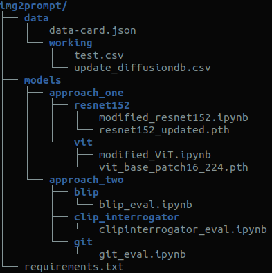

# img2prompt

### Directory structure

`data/` - all the data needed for running our models  
`models/` - code for the models defined in the report with their weights

### Steps to run the notebooks
0. Please download the model checkpoints for the [ResNet](https://drive.google.com/file/d/1AmtzP-2f7ksSBGHO9tItIN9IBJ64c4-2/view?usp=sharing) and [ViT](https://drive.google.com/file/d/1vWtZS8atW-wnLgnz1tOoBcQGQ85EgYeo/view?usp=sharing) to their respective folders.
0. Please download all the data mentioned in `data/data-card.json` into the `data/` folder with the same sub-folder names as the last part of their URL. For eg., data from "https://kaggle.com/competition/abc123" should be stored in the folder `data/abc123/`.
1. `pip install -r requirements.txt`
2. Each model can be run from its notebook.

## Acknowledgement
We sincerely thank Prof. Hegde, and the course assistants for providing us the opportunity to work on this project.
